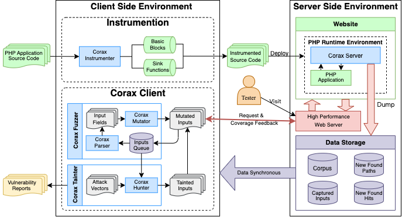

<div align="center">

<br/>
[![license][license-image]][license-url]

[license-image]: http://img.shields.io/badge/license-Apache-blue.svg
[license-url]: https://github.com/Srpopty/Corax/blob/master/LICENSE

English | [简体中文](README_zh.md)

</div>

# Corax

An extensible edge-coverage-guided grey-box fuzzing framework written in PHP, automatically detects and reports vulnerabilities for PHP applications, frameworks and libraries.

> This repository is the source code and improvements for the paper in progress "Corax: An Extensible Grey-Box Fuzzer for PHP Web Applications to Detect Vulnerabilities" and the master's paper "Research and Implementation on Automatic Vulnerability Detection for PHP Application Based on Fuzzing Test and Taint Tracing" of Ocean University of China (OUC).

---

## How does it work

Corax modifies the source code of PHP applications, frameworks, or libraries by instrumenting, collects seeds and explores additional paths based on different mutation strategies of fuzzing, while monitoring the runtime parameters of the target function and using tainting to test that the payload reaches the target function runtime parameters entirely in order to detect vulnerabilities.

<div align="center"></div>

---

## Features

The main features of Corax are:

* **Unique Fuzzing and Tainting Method**
  * Similar to AFL, Corax exploring unknown paths based on edge-covering-guided grey-box fuzzing.
  * Combined with fuzzing and tainting to implement automatic vulnerability detection and reporting.
* **Instrument Compatibility**
  * Compatible with PHP 5 and PHP 7 (PHP 8 is not fully tested yet).
  * The improved instrument method based on [PHP-Fuzzer](https://github.com/nikic/PHP-Fuzzer) allows Corax to safely monitor most runtime function arguments as the basis of vulnerability detection.
  * In the most cases, instrumented PHP applications, frameworks, or libraries can be moved, deployed, and run independently, the Corax server is invisible to human users at the front end.
* **Efficient Architecture**
  * Efficient testing rate, compatibility and distributable fuzzing based on C/S architecture.
  * The built-in dynamic algorithms eliminate the need to worry about the fuzzing concurrent in most cases, Corax can be adapted automatically at runtime to suit different running environments.
  * Continue running after interruption.
  * Compatible with Linux, MacOS and Windows.
* **Plugin Extensibility**
  * The extensibility based on plugin allows you to customize Corax to fit unusual fuzzing environments, targets and vulnerabilities.
* **Human Readable Reports**
  * A detailed Markdown report will be generated for you by Corax after a new vulnerability detected to quickly analyze and reproduce the vulnerability.

---

## Dependencies

* [PHP](https://github.com/php/php-src) >= 7.0
* [composer](https://github.com/composer/composer) >= 2.3.3
* [PHP-curl](https://www.php.net/manual/en/book.curl.php)
* [PHP-Parser](https://github.com/nikic/PHP-Parser) >= 4.14 (Automatic installed via `composer`)
* [c-pchart](https://github.com/szymach/c-pchart) >= 3.0 (Automatic installed via `composer`)
* Web Servers：Apache、Nginx、IIS、Fast-CGI etc.

---

## Installation

```bash
$ git clone https://github.com/Srpopty/Corax.git ./Corax
$ cd ./Corax && composer install
$ ./bin/corax --help
```

---

## Quick Start

### Step 1: Instrument

```bash
$ ./bin/corax -i -s ../php_application/ -d ../instrumented_application/
```

The `-i` indicates Corax to perform instrument, `-s` specifies the source directory of the PHP application, framework, or library to be instrumented, and `-d` is optional and specifies the directory in which to save the instrumented files, which are overwritten to the source directory if this parameter is not provided.

Tips:

* Corax does not instrument PHP files or directories suspected of being used as a cache.
* Instrument failed source files will be prompted and copied directly to the destination directory unchanged.
* By default, Corax assumes that the target PHP application, framework or library is written in PHP 7, and this can be modified via command line arguments.
* Corax builds in a large number of functions that may trigger vulnerabilities as targets for runtime parameter monitoring and instruments those functions, but some functions will not be instrumented when Corax completely identifies that all the parameters are constant.

### Step 2：Deploy

If the step 1 is successful, a new directory named `__corax__` can be found in the destination directory where saving the instrumented files. This directory is called the "nest", and saves the Corax server and related files, while the rest of the file structure remains unchanged.

After that, the instrumented PHP application, framework or library containing Corax server can be deployed on a wen server as normal.

```bash
$ rm -r /var/www/html/ && mv ../instrumented_application/ /var/www/html/
```

Modify the configuration file for the PHP application, framework or library and install the application (if required).

Tips:

* In fact, to avoid unnecessary hassle, the step 1 and 2 can be exchanged, and it is **more recommended** to instrument the target PHP application, framework, or library after the deployment is complete.

```bash
$ ./bin/corax -i -s /var/www/html/
```

### Step 3: Seeds Collecting

The seed is the HTTP request message triggered by the user. You can browse and manipulate your deployed PHP application, framework, or library (aka website) as usual, and in the process the Corax server automatically collect and log all of your requests and uses as a seed.

You can also login to the target website in this step to allow the Corax server to collect the seed for the session that needs to be retained. All your actions become the basic unit of fuzzing for the Corax client, so the coverage of the fuzzing seed depends on the scope of your operations.

Tips:

* It is possible to use some automatic crawlers such as BurpSuite, which can reduce your work but may collect lower quality seeds.
* You should try to **avoid** instrument the target website after configuring it on the front-end. These operations need to be completed **before** instrumenting, otherwise the Corax server may collect HTTP requests that modify the website configuration and irreversibly damage the website during fuzzing.
* To improve the stability and success of fuzzing, it is recommended to change some of the configuration of `php.ini` (assuming you are using Apache2 and running on Linux):

```bash
$ sudo sed -i "s/disable_functions = /; disable_functions = /g" /etc/php/?.?/apache2/php.ini
$ sudo sed -i "s/max_execution_time = 30/max_execution_time = 60/g" /etc/php/?.?/apache2/php.ini
$ sudo sed -i "s/max_input_time = 60/max_input_time = -1/g" /etc/php/?.?/apache2/php.ini
$ sudo sed -i "s/;max_input_vars = 1000/max_input_vars = 3000/g" /etc/php/?.?/apache2/php.ini
$ sudo sed -i "s/memory_limit = 128M/memory_limit = 256M/g" /etc/php/?.?/apache2/php.ini
$ sudo sed -i "s/display_errors = Off/display_errors = On/g" /etc/php/?.?/apache2/php.ini
$ sudo sed -i "s/display_startup_errors = Off/display_startup_errors = On/g" /etc/php/?.?/apache2/php.ini
$ sudo sed -i "s/post_max_size = 8M/post_max_size = 32M/g" /etc/php/?.?/apache2/php.ini
$ sudo sed -i "s/allow_url_include = Off/allow_url_include = On/g" /etc/php/?.?/apache2/php.ini
$ sudo sed -i "s/;mysqli.allow_local_infile = On/mysqli.allow_local_infile = On/g" /etc/php/?.?/apache2/php.ini
$ sudo sed -i "s/session.gc_maxlifetime = 1440/session.gc_maxlifetime = 259200/g" /etc/php/?.?/apache2/php.ini
$ sudo sed -i "s/session.cookie_lifetime = 0/session.cookie_lifetime = 259200/g" /etc/php/?.?/apache2/php.ini
$ sudo systemctl restart apache2
```

### Step 4: Start Fuzzing

The fuzzing can be started at any time after enough seeds have been collected. More precisely, this step consists of fuzzing together with tainting, which will run simultaneously.

```bash
$ ./bin/corax -f -t -u http://127.0.0.1/
```

The `-f` parameter indicates that Corax should run in fuzzing mode, `-t` indicates that Corax should also run in tainting mode, and `-u` specifies the URL of the fuzzing target that contains the Corax server. After fuzzing started, an UI interface that displays the runtime data will appeared in terminal.

Corax will generate the logging file `corax.log` in the current working directory, as well as the directory `Corax_[a-zA-Z0-9]{8}` which saves all of Corax's runtime data, and the subdirectory `reports` which saves Markdown-formatted vulnerability reports as new vulnerabilities are discovered.

Tips:

* Corax can be interrupted at any time and supports continuation after an interruption.
* Corax nest directory `__corax__` must be accessible by target fuzzing URL.
* You can still continue to browse the website and generate new seeds during fuzzing.
* To make fuzzing as efficient as possible, it is recommended that running locally on `127.0.0.1`. Of course, distributable Corax allows you to run Corax clients on multiple machines and fuzzing against the same Corax server.
* When both `-f` and `-t` are turned on, Corax will downgrade some of the vulnerability detection capabilities (tainting) to support the path discovery capabilities (fuzzing) for performance reasons. In fact, tainting will only run in lazy mode and complex payloads will not be tested.
* If only `-f` enabled, Corax only explores new paths and does not test any payloads.
* If only `-t` enabled, Corax only tests payloads and does not explore any new paths.

---

## Customized Plugins

The capabilities of Corax can be greatly expanded by using plugin, including target parsing (Parser), mutating (Mutator), encoding or decoding (Encoder), and vulnerability detection (Hunter). The Corax plugin is a PHP file containing the `CoraxPlugin` class, which is specified through the command line `-P` parameter to the plugin file path and loads at runtime. For example, a complete plugin:

```php

<?php
namespace Corax;

use Corax\Fuzz\CoraxInput;
use Corax\Fuzz\CoraxPayload;


class CoraxPlugin
{
    /**
     * Parse HTTP request array to Corax input fields.
     * 
     * @param array $input The raw HTTP input array.
     * @return array|\Corax\Fuzz\CoraxInput The parsed input fields.
     */
    public function p_my_parser($input)
    {
        return new CoraxInput(
            'my_parser', $input,
            // Which value you parsed and want to be fuzzed from http input array.
            $input['data']['get']['my_value'][0],
            // The path to get value parsed from http input array.
            ['get', 'my_value', 0]
        );
    }

    /**
     * Mutate value from parser parsed input fields.
     * 
     * @param mixed $str The value to mutate.
     * @param string $type The parser assigned type.
     * @return mixed|null The mutated value.
     */
    public function m_my_mutator($str, $type)
    {
        // Do something for $str.
        // ...
        return $str;
    }

    /**
     * Encode or decode value which from input fields.
     * 
     * @param mixed $value The value to encode or decode.
     * @return mixed The encoded or decoded value.
     */
    public function e_my_encoder($value)
    {
        // Encode or decode value and return result.
        // ...
        return $value;
    }
    
    /**
     * Detect a vulnerability.
     * 
     * @param \Corax\Fuzz\CoraxHit $hit The hit to hunt.
     * @param string $value The value which triggered this hit. This value is a un-decoded string.
     * @param bool $lazy If enable lazy tainting. In lazy mode, hunter could yield some simple payloads only for a quick taint.
     * @yield array|false|null If an array yield, each array value should be a CoraxPayload object. The false value could be yielded 
     *   if hunter want to stop hunting and no more value will be yielded. If yield a null value, corax will automatically create 
     *   a probe payload with the type "Probe" to check which runtime argument of the target function can be controlled. The return
     *   value of yield is an array, key is yielded payload type and value is an array with target function argument positions which
     *   contain the yield payload completely, but if the payload could not control any argument, the payload type will not be in the
     *   array.
     */
    public function h_my_hunter($hit, $value, $lazy)
    {
        $pos = yield null;  // Which argument positions is controllable?
        
        if (
            // If no argument is controllable
            empty($pos) or 
            // or the controllable argument position is unexpected, stop the hunter.
            ($hit->get_func_name() === 'my_func' and isset($pos['Probe']) and !in_array($pos['Probe'], 1))
        ) yield false;

        $payloads = [];  // Payloads array to be yield.
        if (!$his->vuln_exists('my_hunter', 'my_vuln')) {  // Skip the detected vulnerability.
            // Create a new test payload with type "my_vuln".
            $payloads[] = new CoraxPayload('my_hunter', 'my_vuln', 'my_payload');
        }

        // More different payload can be test at the same time.
        if (!$his->vuln_exists('my_hunter', 'my_other_vuln')) {
            // The false means it is not a vulnerable payload.
            $payloads[] = new CoraxPayload('my_hunter', 'my_other_vuln', 'my_other_payload', false);
        }
        
        // Yield payloads and get taint results.
        $pos = yield $payloads;

        // A vulnerable payload, vuln_exists can check if the payload test successfully.
        if (!$his->vuln_exists('my_hunter', 'my_vuln')) {
            // Payload is filtered of can not arrive the target argument, try more payloads.
            // ...
        }

        // Not a vulnerable payload, check position from the result directly.
        if (isset($pos['my_other_vuln']) and !in_array($pos['my_other_vuln'], 1)) {
            // Could not get an expected position? Try more payloads.
            // ...
        }

        // Check more payloads...
        $pos = yield $payloads;

        // ...

        if (!$lazy) {
            $payloads = [];
            // More complex payloads should be test on non-lazy mode.
            // ...
            yield $payloads;
        }
    }
}

```

### Parser

A public member method that begins with `p_` in the `CoraxPlugin` class is called `parser`. It is split the array of HTTP requests as the input field, which is the smallest test unit of fuzzing and the target of mutation in Corax.

The builtin parsers of Corax can split all the GET, POST, File, Header, Cookie, etc. from HTTP request, and you can still customize new `parser` through plugin to parse special input fields, for example:

```php
<?php
namespace Corax;

use Corax\Fuzz\CoraxInput;


class CoraxPlugin
{
   /**
    * Parse HTTP request array to Corax input fields.
    * 
    * @param array $input The raw HTTP input array.
    * @return array|\Corax\Fuzz\CoraxInput The parsed input fields.
    */
   public function p_my_parser($input)
   {
       return new CoraxInput(
           'my_parser', $input,
           // Which value you parsed and want to be fuzzed from http input array.
           $input['data']['get']['a'],
           // The path to get value parsed from http input array.
           ['get', 'a']
       );
   }
}

```

The `$input` parameter is an array of HTTP requests parsed from the seed, containing the request data and other environmental information. The HTTP request data is stored in `$input['data']`, for example:

```php
$input = [
    'data' => [
        'get' => ['a' => '1', 'b' => ['c' => '2', 'd' => '3']],  // ?a=1&b[c]=2&b[d]=3
        'post' => ['a' => '1', 'b' => ['c' => '2', 'd' => '3']],  // a=1&b[c]=2&b[d]=3
        'path' => ['a', 'b', 'c'],  // /index.php/a/b/c
        'raw_post' => 'test',
        'files' => ['test' => ['filename' => 'test.txt', 'content' => 'test', 'type' => 'text/plain']],
        'cookies' => ['test' => 'test'],
        'headers' => ['test' => 'test']
    ],
    'info' => [
        'php_self' => '/index.php',
        'gateway_interface' => 'CGI/1.1',
        'server_protocol' => 'HTTP/1.1',
        'request_method' => 'POST',
        'query_string' => '?a=1&b[c]=2&b[d]=3',
        'script_filename' => '/var/www/html/index.php',
        'script_name' => '/index.php',
        'web_root' => '/var/www/html',
        'site_root' => '/var/www/html/',
        'request_uri' => '/index.php/a/b/c?a=1&b[c]=2&b[d]=3',
        'get_keys' => [['a', 1], ['b', 'c', 2], ['b', 'd', 3]],
        'post_keys' => [['a', 1], ['b', 'c', 2], ['b', 'd', 3]],
        'feature' => 'a77777661d3e83b0f59c5424b5faa102',
        'path_name' => 'p-4ba06a8d813a5534bef4338c8a995b62',
        'hits' => ['89292ae8c3e8c2a66374509c952efd62' => 'h-098f6bcd4621d373cade4e832627b4f6'],
        'mutated' => [
            'http_request' => ['raw_http_input']
        ],
        'time' => 1696254948.012345,
        'coverage_edges' => 1
    ]
];
```

The `parser` needs to return a `CoraxInput` object or an array with `CoraxInput` objects. The signature of constructor is `CoraxInput($type, $value = ", $value_path = null, $detect_encoding = true)`.

* `$type` is used to uniquely identify a `CoraxInput` returned by a `parser`.
* `$value` is the initial value string of the input field which split from HTTP request, and this value will be processed by the `mutator` during fuzzing.
* `$value_path` array is used to identify how to obtain the value input filed from `$input['data']`, such as `['get', 'a']` identifying `$input['data']['get']['a']`.
* `$detect_encoding` enables automatic detection of the encoding type of an input field initial value string, currently supported: json, urlencode, and base64.

Tips:

* If the encoding type of the input field value can be determined in advance, the encoding type and the name of the `encoder` for encoding and decoding can be specified by the member method of `CoraxInput` object `set_encoding($encoding, $encoder, $decoder)`.

For more information about the `CoraxInput` class, refer to the [documentation](./docs/classes/Corax-Fuzz-CoraxInput.html).

### Mutator

A public member method that begins with `m_` in the `CoraxPlugin` class is called `mutator`. It is used to mutate the input fields parsed from `parser`.

The builtin `mutator` of Corax can modify, insert, and delete strings, filenames, characters in file types, special characters, or numbers, etc. You can still customize new `mutator` through plugin to mutate special input fields or enhance Corax mutating capabilities, for example:

```php
<?php
namespace Corax;


class CoraxPlugin
{
   /**
    * Mutate value from parser parsed input fields.
    * 
    * @param mixed $str The value to mutate.
    * @param string $type The parser assigned type.
    * @return mixed|null The mutated value.
    */
   public function m_my_mutator($str, $type)
    {
        // Do something for $str...
        return $str;
    }
}

```

Tips:

* Considering that the value of the input field may be encoded, `$str` is not always a string, such as an array decoded by json `encoder`.
* `$type` can be used to distinguish the `$str` comes from which `parser`.
* When the mutator returns `null`, Corax will consider its a mutation failure or rejecting mutation.

### Encoder

A public member method that begins with `e_` in the `CoraxPlugin` class is called `encoder`. It is used to encode and decode the values of the input field, and it is usually used in conjunction with `CoraxInput` that generated in `parser`.

The builtin `encoder` in Corax are: base64, urlencode, and json, and you can still customize new `encoder` through plugin to encode or decode special values, for example:

```php

<?php
namespace Corax;


class CoraxPlugin
{
    /**
     * Encode or decode value which from input fields.
     * 
     * @param mixed $value The value to encode or decode.
     * @return mixed The encoded or decoded value.
     */
    public function e_my_encoder($value)
    {
        // Encode or decode value and return result.
        // ...
        return $value;
    }
}

```

Tips:

* In most cases, encoding and decoding are two corresponding `encoder`, the value of input field will be automatically decoded before being mutated by `mutator`, if the `Coraxinput` object has been set an `encoder`, and then encoded again into a string after the mutation is successful.

### Hunter

A public member method that begins with `h_` in the `CoraxPlugin` class is called `hunter`. It is used to detect different types of vulnerabilities. Unlike the previous `parser`, `mutator` and `encoder`, `hunter` is a generator rather than a function.

The rationale for vulnerability detection of `hunter` is based on a simple fact: `hunter` believes that a vulnerability exists when a function parameter that might trigger the vulnerability can be controlled by a specific set of HTTP inputs, and the job of `hunter` is to mix the payload into the input field via tainting and test the instrumented target function, which is the function that might trigger the vulnerability, whether there is a full payload existed in the runtime parameter.

The builtin `hunter` in Corax for common Web vulnerabilities are: XSS, RCE, variable coverage, deserialization, SSTI, command execution, SQL injection, and XXE. Usually one hunter is used to test a type of vulnerability. You can still customize new `hunter` through plugin to test for less common or complex vulnerabilities, for example:

```php
<?php 
namespace Corax;

use Corax\Fuzz\CoraxPayload;


class CoraxPlugin
{
    /**
     * Detect a vulnerability.
     * 
     * @param \Corax\Fuzz\CoraxHit $hit The hit to hunt.
     * @param string $value The value which triggered this hit. This value is a un-decoded string.
     * @param bool $lazy If enable lazy tainting. In lazy mode, hunter could yield some simple payloads only for a quick taint.
     * @yield array|false|null If an array yield, each array value should be a CoraxPayload object. The false value could be yielded 
     *   if hunter want to stop hunting and no more value will be yielded. If yield a null value, corax will automatically create 
     *   a probe payload with the type "Probe" to check which runtime argument of the target function can be controlled. The return
     *   value of yield is an array, key is yielded payload type and value is an array with target function argument positions which
     *   contain the yield payload completely, but if the payload could not control any argument, the payload type will not be in the
     *   array.
     */
    public function h_my_hunter($hit, $value, $lazy)
    {
        $pos = yield null;  // Which argument positions is controllable?
        
        if (
            // If no argument is controllable
            empty($pos) or 
            // or the controllable argument position is unexpected, stop the hunter.
            ($hit->get_func_name() === 'my_func' and isset($pos['Probe']) and !in_array($pos['Probe'], 1))
        ) yield false;

        $payloads = [];  // Payloads array to be yield.
        if (!$his->vuln_exists('my_hunter', 'my_vuln')) {  // Skip the detected vulnerability.
            // Create a new test payload with type "my_vuln".
            $payloads[] = new CoraxPayload('my_hunter', 'my_vuln', 'my_payload');
        }

        // More different payload can be test at the same time.
        if (!$his->vuln_exists('my_hunter', 'my_other_vuln')) {
            // The false means it is not a vulnerable payload.
            $payloads[] = new CoraxPayload('my_hunter', 'my_other_vuln', 'my_other_payload', false);
        }
        
        // Yield payloads and get taint results.
        $pos = yield $payloads;

        // A vulnerable payload, vuln_exists can check if the payload test successfully.
        if (!$his->vuln_exists('my_hunter', 'my_vuln')) {
            // Payload is filtered of can not arrive the target argument, try more payloads.
            // ...
        }

        // Not a vulnerable payload, check position from the result directly.
        if (isset($pos['my_other_vuln']) and !in_array($pos['my_other_vuln'], 1)) {
            // Could not get an expected position? Try more payloads.
            // ...
        }

        // Check more payloads...
        $pos = yield $payloads;

        // ...

        if (!$lazy) {
            $payloads = [];
            // More complex payloads should be test on non-lazy mode.
            // ...
            yield $payloads;
        }
    }
}
```

* `$hit` is an instance object of the class `CoraxHit` that represents a hit of the target function that might trigger the vulnerability, saving runtime information about the target function, including: input field, paths, function name, runtime parameters, return value, call stacks, etc., which can assist `hunter` to generate payload for the target function.
* `$value` is the value of the input field that hits the target function, noticed that the value is a raw string that has not been processed by the `encoder`.
* `$lazy` indicates whether the tainting is running in lazy mode, where hunter should test as simple payload as possible.

`hunter` should commit three value types using `yield`:

* `array`: Each element in the array is an object of the `CoraxPayload` class to be tested.
* `false`: The `hunter` will actively stop testing for a hit (`CoraxHit`) and Corax will no longer call this `hunter` for testing the hit.
* `null`: Corax will automatically generate a `CoraxPayload` object with type `Probe` and a random payload string, which is used to detect whether it can fully hit which parameters of the target function.

In the array `yield` by `hunter`, each payload should be an instance object of the class `CoraxPayload`, the constructor is

`CoraxPayload($hunter, $type, $payload, $is_vuln = true, $mix = true, $arg_pos = -1, $checker = null)`。

* `$hunter` is the name of the `hunter`, and an incorrect name will cause the payload test result to be sent by Corax to another `hunter`.
* `$type` indicates the vulnerability type of the payload.
* `$payload` is the the payload string to be tested.
* `$is_vuln` indicates if the payload tested successfully, whether can prove that the target function has vulnerability. If this parameter is enabled and the payload test is successful, which means a complete payload appears in the target function runtime parameter, Corax will determine that there is a vulnerability in the function and automatically generate a vulnerability report. You can disable this parameter if you only want to determine whether the payload can reach the target function parameter completely.
* `$mix` indicates whether payload needs to be randomly mixed in the input field value. Corax has a variety of random mixed strategies, including insertion, delete, and replacement. If this parameter is disabled, the entire input field value will be replaced by payload.
* `$arg_pos` specify the argument position index what you expect payload to appear in the target function. The first argument starts with `0`, and `-1` or other negative number indicates that all positions are acceptable.
* `$checker` provides a callback function where you can specify your own checker to check the payload test results. That signature of checker is `($payload, $raw_hit, $pos)`
  * `$payload` is the tested payload string.
  * `$raw_hit` is the original hit array, including function name, runtime parameters, return value, call stack, and so on.
  * `$pos` is the argument position array what payload appears in target function.
  * The checker also needs to return an array containing the argument positions of the target function. If no checker is specified, Corax simply determines whether the payload is present in the expected function argument based on `$arg_pos`.

`yield` returns an array of argument position for the tested payload, which you can use to determine whether the payload fully reaches the desired target function parameters, and which payload to test next. The key of the array is payload `$type`, and the value is an array of target function argument positions, containing all parameter positions where the full payload appears, which can be restricted by `$arg_pos`.

Tips:

* Corax concurrently tests `hunter` by coroutines for all payloads contained in each `yield`, so if you need to test multiple payloads that have no precursor dependencies, they should be committed in the same `yield` round.
* You can check if a vulnerability exists which proofed by a certain tested payload by using the member method `vuln_exists($hunter, $type)` of the class `CoraxHit`.
* An example of the `$raw_hit` parameter of the callback function `$checker` is as follows, the first element of the array is the target function information, followed by the call stack. All original values in `args` and `ret` are escaped as strings, and values wrapped in `"` are string type.
  
```php
$raw_hit = [
    [
        'func' => 'target_func',
        'args' => [
            '1',  # Integer type
            '1.1',  # Float type
            '"string_value"',  # String type
            'true'  # Boolean type
        ],
        'file' => '/var/ww/html/target.php',
        'start_pos' => 152,
        'end_pos' => 166,
        'start_line' => 54,
        'end_line' => 54,
        'ret' => 'null',  # null type
        'path' => [1, 187935, 1257899, 8912],
        'path_name' => "p-d7e4314c60983b0252eaad11c9263964",
        'new_path' => true,
        'feature' => '05c6808f7a4b50ded83aede8f65f7366',
        'prev_block' => 37195
    ],
    ['func' => 'bar', 'file' => '/var/www/html/bar.php', 'line' => 11],
    ['func' => 'foo', 'file' => '/var/www/html/foo.php', 'line' => 35],
    ['func' => 'handle_request', 'file' => '/var/www/html/index.php', 'line' => 24],
];

```

For more information about the `CoraxHit` class, refer to the [documentation](./docs/classes/Corax-Fuzz-CoraxHit.html).

For more information about the `CoraxPayload` class, refer to the [documentation](./docs/classes/Corax-Fuzz-CoraxPayload.html).

---

## Advanced Usage

Corax can be controlled freely through some command line arguments.

### Instrument

If the destination directory exists, force overwrite before instrumenting.

```bash
$ ./bin/corax -i -s ../my_application/ -d ../instrumented_application/ -O
```

Checks if the target directory is already instrumented before instrumenting.

```bash
$ ./bin/corax -i -s ../my_application/ -d ../instrumented_application/ --instrument-check
```

By default, Corax only instruments `.php` suffixed files. Based on the default values, use the `-E` parameter to instrument `.inc`, `.abc`, and `.aaa` suffixed files. Multiple suffixes are separated by `,`. Regular expressions supports.

```bash
$ ./bin/corax -i -s ../my_application/ -d ../instrumented_application/ -E 'inc,a(bc|aa)'
```

By default, Corax will not instrument files or directories that suspected of being used as caches (`/caches?/,[a-f0-9]{16}\.php$`), which is controlled by the `-X` parameter. Based on the default values, use the `-X` parameter to exclude files in third-party libraries and PHP files in the `test` directory when instrumenting. Multiple files are separated by `,`. Regular expressions supports.

```bash
$ ./bin/corax -i -s ../my_application/ -d ../instrumented_application/ -X '/vendor/,/test/.*.php$'
```

By default, the instrument target of Corax written in PHP 7, with the `-p` parameter specifying a special PHP version, such as PHP 5.

```bash
$ ./bin/corax -i -s ../my_application/ -d ../instrumented_application/ -p 5
```

By default, Corax instruments functions that may trigger vulnerabilities in all instrumentable files, using the `-W` parameter to specify only instrumenting these functions in certain files, such as instrumenting functions only used in `target.php`, `vuln1.php`, and `vuln2.php`. Multiple files are separated by `,`. Regular expressions supports.

```bash
$ ./bin/corax -i -s ../my_application/ -d ../instrumented_application/ -W 'target\.php,vuln[1-2]\.php'
```

By default, Corax instruments multiple functions that may trigger vulnerabilities, such as:

```php
<?php

$targets = [
        'xss' => [
            'debug_zval_dump', 'echo', 'exit', 'die', 'print', 'printf', 'var_dump',
            'image2wbmp', 'imageavif', 'imagebmp', 'imagegd', 'imagegd2', 'imagegif', 'imagejpeg',
            'imagepng', 'imagewbmp', 'imagewebp', 'imagexbm',
            'var_export', 'vprintf',
            'Exception', 'Error'
        ],
        'command_execution' => [
            'system', 'shell_exec', 'exec', 'expect_popen', 'proc_open', 'ssh2_exec',
            'Swoole\\\\Process::exec', 'passthru', 'pcntl_exec', 'popen', 'except_popen',
        ],
        'environ_rewrite' => [
            'putenv'
        ],
        'var_rewrite' => ['extract', 'import_request_variables', 'parse_str'],
        'unserialize' => ['unserialize'],
        'ssti' => ['.*->render', 'Smarty_Internal_Write_File::writeFile'],
        'rce' => [
            'eval', 'assert'
        ],
        'ssrf' => [
            'curl_multi_setopt', 'curl_setopt', 'curl_setopt_array',
            'hash_file', 'hash_hmac_file', 'md5_file',
            'include', 'include_once', 'require', 'require_once',
            'get_headers', 'SoapClient', 'gzopen',
            'copy', 'highlight_file', 'show_source', 'parse_ini_file', 'fopen', 'SplFileObject', 'file_get_contents',
            'file', 'readfile', 'gzfile', 'readgzfile', 'getimagesize', 'imagecreatefromgif', 'imagecreatefromjpeg',
            'imagecreatefrompng', 'imagecreatefromwbmp',  'imagecreatefromxbm', 'imagecreatefromxpm', 'exif_read_data',
            'read_exif_data', 'exif_thumbnail', 'exif_imagetype', 'php_strip_whitespace', 'get_meta_tags',
            'mime_content_type', 'imageloadfont'
        ],
        'sqli' => [
            '.*->query', '.*->multi_query', '.*->real_query', '.*->exec', '.*->execute', 'pg_query',
            'mysql_query', 'mysql_unbuffered_query', 'mysql_db_query', 'mysqli_query', 'mysqli_real_query',
            'mysqli_master_query', 'mysqli_multi_query', 'mysqli_stmt_execute', 'mysqli_execute',
            'db2_exec', 'pg_send_query'
        ],
        'xxe' => ['.*->loadXML', '.*->loadHTML', 'simplexml_load_string', 'SimpleXMLElement'],
        'file_upload' => ['move_uploaded_file'],
        'file_include' => ['include', 'include_once', 'require', 'require_once'],
        'file_access' => [
            'bzopen', 'chdir', 'chroot', 'copy', 'dir', 
            'touch', 'alter_ini', 'highlight_file', 'show_source', 'ini_alter', 'fgetcsv',
            'ini_get_all', 'openlog', 'syslog', 'rename', 'parse_ini_file', 'fopen', 'tmpfile',
            'gzopen', 'SplFileObject', 'chgrp', 'chmod', 'chown', 'file_put_contents', 'lchgrp',
            'lchown', 'link', 'mkdir', 'move_uploaded_file', 'rmdir', 'symlink', 'tempnam', 'unlink',
            'image2wbmp', 'imageavif', 'imagebmp', 'imagegd', 'imagegd2', 'imagegif', 'imagejpeg',
            'imagepng', 'imagewbmp', 'imagewebp', 'imagexbm', 'iptcembed', 'ftp_get', 'ftp_nb_get',
            'file_exists', 'file_get_contents', 'file', 'fileatime', 'filectime', 'filegroup',
            'fileinode', 'filemtime', 'fileowner', 'fileperms', 'filesize', 'filetype', 'glob',
            'is_dir', 'is_executable', 'is_file', 'is_link', 'is_readable', 'is_uploaded_file',
            'is_writable', 'is_writeable', 'linkinfo', 'lstat', 'pathinfo', 'readfile', 'readlink',
            'realpath', 'stat', 'gzfile', 'readgzfile', 'getimagesize', 'imagecreatefromgif',
            'imagecreatefromjpeg', 'imagecreatefrompng', 'imagecreatefromwbmp', 'imagecreatefromxbm',
            'imagecreatefromxpm', 'ftp_put', 'ftp_nb_put', 'exif_read_data', 'read_exif_data',
            'exif_thumbnail', 'exif_imagetype', 'hash_file', 'hash_hmac_file', 'hash_update_file',
            'md5_file', 'md5_file', 'php_strip_whitespace', 'get_meta_tags', 'mime_content_type',
            'imageloadfont', 'include', 'include_once', 'require', 'require_once'
        ],
```

Based on the default values, use the `-w` parameter to instrument more functions, such as the `foo`, `bar1`, `bar2`, `Foo:a` and `.*->b`. Multiple functions are separated by ','. Class functions and member functions supports. Regular expressions supports.

```bash
$ ./bin/corax -i -s ../my_application/ -d ../instrumented_application/ -w 'foo,bar[1-2],Foo:a,.*->b'
```

### Fuzzing

Check whether the target url is fuzzable before fuzzing.

```bash
$ ./bin/corax -f -u http://127.0.0.1/instrumented_application/ --fuzz-check
```

During the instrumenting, Corax automatically collects the short strings in the source code as a corpus dictionary and provides them to the `mutator` during the fuzzing. You can provide an additional corpus dictionary directory, where one corpus is stored in each file, before fuzzing.

```bash
$ ./bin/corax -f -u http://127.0.0.1/instrumented_application/ --corpus
```

Disables the specified `mutator` during fuzzing, for example, `my_mutator`, `mutator2`, `mutator3`. Multiple `mutator` are separated by `,`. Regular expressions supports.

```bash
$ ./bin/corax -f -u http://127.0.0.1/instrumented_application/ --disable-mutators 'my_mutator,mutator[2-3]'
```

Disable the specified `parser` during fuzzing, for example, `my_parser`, `parser2`, `parser3`. Multiple `parser` are separated by `,`. Regular expressions supports.

```bash
$ ./bin/corax -f -u http://127.0.0.1/instrumented_application/ --disable-parsers 'my_parser,parser[2-3]'
```

Disable the specified `encoder` during fuzzing, for example, `my_encoder`, `encoder2`, `encoder3`. Multiple `encoder` are separated by `,`. Regular expressions supports.

```bash
$ ./bin/corax -f -u http://127.0.0.1/instrumented_application/ --disable-encoders 'my_encoder,encoder[2-3]'
```

### Tainting

Disable the specified `hunter` during fuzzing, for example, `my_hunter`, `hunter2`, `hunter3`. Multiple `hunter` are separated by `,`. Regular expressions supports.

```bash
$ ./bin/corax -t -u http://127.0.0.1/instrumented_application/ --disable-hunters 'my_hunter,hunter[2-3]'
```

During the tainting, using the specified `hunter` based on the default value to test instrumented target function, for example, the hunter `xss` is used to test the `echo` and `print` function, and test the `foo`, `bar1`, and `bar2` function with `my_hunter`. Multiple functions separated by `,`, multiple `hunter` separated by `;`, the target function supports regular expressions.

```bash
$ ./bin/corax -t -u http://127.0.0.1/instrumented_application/ --hunt 'xss:echo,print;my_hunter:foo,bar[10-2]'
```

---

## Achievements

* Typecho
  * [CVE-2023-27130](https://www.cve.org/CVERecord?id=CVE-2023-27130)：Cross Site Scripting vulnerability found in Typecho v.1.2.0 allows a remote attacker to execute arbitrary code via an arbitrarily supplied URL parameter.
  * [CVE-2023-27131](https://www.cve.org/CVERecord?id=CVE-2023-27131)：Cross Site Scripting vulnerability found in Typecho v.1.2.0 allows a remote attacker to execute arbitrary code via the `Post Editor` parameter.
  * [CVE-2023-27711](https://www.cve.org/CVERecord?id=CVE-2023-27711)：Cross Site Scripting vulnerability found in Typecho v.1.2.0 allows a remote attacker to execute arbitrary code via the `Comment Manager` `/admin/manage-comments.php` component.
* EyouCMS
  * [CVE-2022-45537](https://www.cve.org/CVERecord?id=CVE-2022-45537)：EyouCMS <= 1.6.0 was discovered a reflected-XSS in the article publish component in cookie `ENV_LIST_URL`.
  * [CVE-2022-45538](https://www.cve.org/CVERecord?id=CVE-2022-45538)：EyouCMS <= 1.6.0 was discovered a reflected-XSS in the article publish component in cookie `ENV_GOBACK_URL`.
  * [CVE-2022-45539](https://www.cve.org/CVERecord?id=CVE-2022-45539)：EyouCMS <= 1.6.0 was discovered a reflected-XSS in the `FileManager` component in GET value `activepath` when creating a new file.
  * [CVE-2022-45540](https://www.cve.org/CVERecord?id=CVE-2022-45540)：EyouCMS <= 1.6.0 was discovered a reflected-XSS in the `article type editor` component in POST value `name` if the value contains a malformed UTF-8 char.
  * [CVE-2022-45541](https://www.cve.org/CVERecord?id=CVE-2022-45541)：EyouCMS <= 1.6.0 was discovered a reflected-XSS in the `article attribute editor` component in POST value `value` if the value contains a non-integer char.
  * [CVE-2022-45542](https://www.cve.org/CVERecord?id=CVE-2022-45542)：EyouCMS <= 1.6.0 was discovered a reflected-XSS in the `FileManager` component in GET parameter `filename` when editing any file.
* Discuz
  * [CVE-2022-45543](https://www.cve.org/CVERecord?id=CVE-2022-45543)：Cross site scripting (XSS) vulnerability in DiscuzX 3.4 allows attackers to execute arbitrary code via the `datetline`, `title`, `tpp`, or `username` parameters via the `audit search`.
* DedeCMS
  * [CVE-2023-27707](https://www.cve.org/CVERecord?id=CVE-2023-27707)：SQL injection vulnerability found in DedeCMS v.5.7.106 allows a remote attacker to execute arbitrary code via the `rank_*` parameter in the /dede/group_store.php endpoint.
  * [CVE-2023-27708](https://srpopty.github.io/2023/02/26/DedeCMS-V5.7.160-Backend-Reflected-XSS-upload/)：Backend image file upload with reflected-XSS in uploaded filename.
  * [CVE-2023-27709](https://www.cve.org/CVERecord?id=CVE-2023-27709)：SQL injection vulnerability found in DedeCMS v.5.7.106 allows a remote attacker to execute arbitrary code via the `rank_*` parameter in the `/dedestory_catalog.php` endpoint.
* Joomla
  * [CVE-2023-23754](https://huntr.dev/bounties/1fb9daa4-417a-4730-bb9e-46ea0b865184/)：Admin backend Multi-factor Authentication component with reflected-XSS via base64-encoded GET parameters `returnurl`.

---

## Acknowledgements

* Thanks [PHP-Parser](https://github.com/nikic/PHP-Parser) for providing PHP AST analysis capabilities.
* Thanks [PHP-Fuzzer](https://github.com/nikic/PHP-Fuzzer) for the inspiration for Corax instrument algorithm.
* Thanks the Lab of Informaiton and Security at Ocean University of China ([ISLOUC](https://github.com/ISLOUC)) for providing the test environments。

---

## Contributors

* [youops](https://github.com/youops)
* [盐焗小星球](https://github.com/yingning620)
* [DiliLearngent](https://github.com/DiliLearngent)

