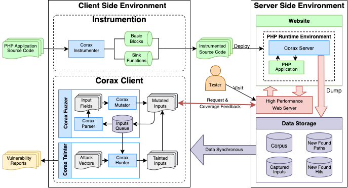

<div align="center">

<br/>
[![license][license-image]][license-url]

[license-image]: http://img.shields.io/badge/license-Apache-blue.svg
[license-url]: https://github.com/Srpopty/Corax/blob/master/LICENSE

[English](README.md) | 简体中文

</div>

# Corax

一个可扩展的基于边覆盖引导的灰盒模糊测试框架，使用PHP编写，自动检测并报告 PHP 应用、框架与库的漏洞。

> 本仓库为在投论文《Corax: An Extensible Grey-Box Fuzzer for PHP Web Applications to Detect Vulnerabilities》以及中国海洋大学（OUC）硕士学位论文《基于模糊测试与污点追踪的PHP应用自动漏洞检测技术研究与实现》的源代码及改进。

---

## 它是如何工作的

Corax 通过插桩修改 PHP 应用、框架或库的源代码，在收集种子后基于不同的变异策略使用模糊测试探索更多的路径，同时监控目标函数的运行时参数并且使用污点追踪测试 payload 是否可以完整到达目标函数参数以检测漏洞是否存在。

<div align="center"></div>

---

## 特点

Corax的主要特点有：

* **独特的模糊测试与污点追踪方法**
  * 基于类似 AFL 的边覆盖引导的模糊测试探索未知路径。
  * 结合污点追踪实现自动漏洞检测与报告。
* **插桩兼容性**
  * 兼容 PHP 5 与 PHP 7（PHP 8 暂未完全测试）。
  * 基于 [PHP-Fuzzer](https://github.com/nikic/PHP-Fuzzer) 插桩方法的改进使 Corax 可以安全地监视大部分函数运行时参数，并以此作为判断是否存在漏洞的依据。
  * 在大部分情况下插桩后的 PHP 应用、框架或者库可以不受影响得被移动、部署与运行，Corax 服务器在前端对人类使用者来说是不可见的。
* **高效架构**
  * 基于 C/S 架构的高效测试速率、兼容性以及分布式模糊测试。
  * 内置的动态算法使您在大部分情况下无需担心测试的并发数量，Corax 可以自己在运行时调整以适应不同的运行环境。
  * 中断后继续测试。
  * 尽可能兼容 Linux、MacOS 与 Windows。
* **插件扩展性**
  * 基于插件的扩展性使您可以定制化 Corax 以适应不同寻常的测试环境、目标与漏洞。
* **人类可读的报告**
  * Corax 将在发现新漏洞后生成详细的 Markdown 格式报告便于您快速分析与复现漏洞。

---

## 依赖

* [PHP](https://github.com/php/php-src) >= 7.0
* [composer](https://github.com/composer/composer) >= 2.3.3
* [PHP-curl](https://www.php.net/manual/en/book.curl.php)
* [PHP-Parser](https://github.com/nikic/PHP-Parser) >= 4.14（自动通过 `composer` 安装）
* [c-pchart](https://github.com/szymach/c-pchart) >= 3.0（自动通过 `composer` 安装）
* Web 服务器：Apache、Nginx、IIS、Fast-CGI 等...

---

## 安装

```bash
$ git clone https://github.com/Srpopty/Corax.git ./Corax
$ cd ./Corax && composer install
$ ./bin/corax --help
```

---

## 快速开始

### 第一步：插桩

```bash
$ ./bin/corax -i -s ../php_application/ -d ../instrumented_application/
```

参数 `-i` 指示 Corax 执行插桩操作， `-s` 指定需要插桩的PHP应用、框架或库的源目录，`-d` 是可选的并指定保存插桩结果的目录，插桩结果将被覆盖至源目录如果没有提供该参数。

提示：

* Corax 不会对疑似被用作缓存的 PHP 文件或目录插桩。
* 插桩失败的源文件将被提示并且被原封不动地直接复制到目标目录中。
* Corax 默认认为目标 PHP 应用、框架或库被 PHP 7 编写，可以通过命令行参数修改。
* Corax 内置了大量可能会触发漏洞的函数作为运行时参数监视的目标并插桩这些函数，但是当 Corax 完全判断一个函数参数为常量时不会插桩该函数。

### 第二步：部署

若第一步成功，一个以 `__corax__` 命名的新目录可以在保存插桩结果的目标目录中发现，该目录被称为“巢穴”，保存 Corax 服务器以及相关文件，其余文件结构没有被改变。

之后包含 Corax 服务器的被插桩的 PHP 应用、框架或者库需要被部署在一个 Web 服务器中像正常一样。

```bash
$ rm -r /var/www/html/ && mv ../instrumented_application/ /var/www/html/
```

修改 PHP 应用、框架或库的配置文件，并且安装应用（如果需要）。

提示：

* 实际上为了避免不必要的麻烦，第一步和第二步可以交换，**更加推荐**部署完成后再对目标 PHP 应用、框架或库插桩：`./bin/corax -i -s /var/www/html/`

### 第三步：收集种子

种子就是用户触发的 HTTP 请求报文。您可以像往常一样浏览并操作部署后的 PHP 应用、框架或库（也就是网站），在这个过程中 Corax 服务器会自动收集并记录您的所有请求并作为种子。

您也可以在此步骤中登录目标网站以便于 Corax 服务器收集到需要保留 session 的种子。您的所有操作都将成为 Corax 客户端的模糊测试基本单元，因此模糊测试种子的覆盖率取决于您操作的范围。

提示：

* 使用一些例如 BurpSuite 的自动爬虫是可行的，可以减少您的工作量但是可能会收集到质量较低的种子。
* 您应该尽量**避免**在前端配置插桩后的目标网站，这些操作需要在**插桩前**被完成，否则可能会使 Corax 服务器收集到修改网站配置的 HTTP 请求并在模糊测试的过程中对网站造成不可逆的破坏。
* 为了提高模糊测试的稳定性与成功率，推荐修改 `php.ini` 的部分配置（假设您使用了 Apache2 并在 Linux 中测试）：

```bash
$ sudo sed -i "s/disable_functions = /; disable_functions = /g" /etc/php/?.?/apache2/php.ini
$ sudo sed -i "s/max_execution_time = 30/max_execution_time = 60/g" /etc/php/?.?/apache2/php.ini
$ sudo sed -i "s/max_input_time = 60/max_input_time = -1/g" /etc/php/?.?/apache2/php.ini
$ sudo sed -i "s/;max_input_vars = 1000/max_input_vars = 3000/g" /etc/php/?.?/apache2/php.ini
$ sudo sed -i "s/memory_limit = 128M/memory_limit = 256M/g" /etc/php/?.?/apache2/php.ini
$ sudo sed -i "s/display_errors = Off/display_errors = On/g" /etc/php/?.?/apache2/php.ini
$ sudo sed -i "s/display_startup_errors = Off/display_startup_errors = On/g" /etc/php/?.?/apache2/php.ini
$ sudo sed -i "s/post_max_size = 8M/post_max_size = 32M/g" /etc/php/?.?/apache2/php.ini
$ sudo sed -i "s/allow_url_include = Off/allow_url_include = On/g" /etc/php/?.?/apache2/php.ini
$ sudo sed -i "s/;mysqli.allow_local_infile = On/mysqli.allow_local_infile = On/g" /etc/php/?.?/apache2/php.ini
$ sudo sed -i "s/session.gc_maxlifetime = 1440/session.gc_maxlifetime = 259200/g" /etc/php/?.?/apache2/php.ini
$ sudo sed -i "s/session.cookie_lifetime = 0/session.cookie_lifetime = 259200/g" /etc/php/?.?/apache2/php.ini
$ sudo systemctl restart apache2
```

### 第四步：开始模糊测试

在足够的种子收集完成后，模糊测试可以随时开始。更准确来讲，该步骤由模糊测试与污点追踪共同组成，模糊测试与污点追踪将同时运行。

```bash
$ ./bin/corax -f -t -u http://127.0.0.1/
```

参数 `-f` 指示 Corax 开启模糊测试模式，`-t` 指示 Corax 同时开启污点追踪模式，`-u` 指定包含了 Corax 服务器的测试目标的 URL。在测试开始后，终端将会出现一个 UI 界面实时展示数据。

Corax会在当前工作目录下生成日志文件 `corax.log` 以及目录 `Corax_[a-zA-Z0-9]{8}`，该目录中保存了 Corax 的所有运行数据，并且子目录 `reports` 保存了 Markdown 格式的漏洞报告在发现新漏洞后。

提示：

* Corax 可以被随时中断运行，并且支持中断后继续运行。
* Corax 的巢穴目录 `__corax__` 必须可通过 URL 访问。
* 在模糊测试的过程中您仍然可以继续浏览网站并产生新的种子。
* 为了尽可能提高模糊测试的效率，推荐您在本机 `127.0.0.1` 中进行测试。当然，支持分布式的 Corax 允许您在多个机器上运行 Corax 客户端并对同一个 Corax 服务器测试。
* 在同时开启 `-f` 与 `-t` 时，考虑到性能，Corax 将下调一部分漏洞检测能力（污点追踪）以支持路径发现能力（模糊测试）。实际上污点追踪仅会运行在懒模式下，复杂的 payload 将不会被测试。
* 仅开启 `-f` 时，Corax 仅探索新路径，不会测试任何 payload。
* 仅开启 `-t` 时，Corax 仅测试payload，不会探索任何新路径。

---

## 自定义插件

Corax 的能力可以通过插件大幅扩展，包括目标解析（Parser）、变异（Mutator）、编码或解码（Encoder）以及漏洞检测（Hunter）。Corax 插件是一个包含 `CoraxPlugin` 类的 PHP 文件，通过命令行的 `-P` 参数指定该文件路径并在运行时加载插件。例如一个完整的插件：

```php

<?php
namespace Corax;

use Corax\Fuzz\CoraxInput;
use Corax\Fuzz\CoraxPayload;


class CoraxPlugin
{
    /**
     * Parse HTTP request array to Corax input fields.
     * 
     * @param array $input The raw HTTP input array.
     * @return array|\Corax\Fuzz\CoraxInput The parsed input fields.
     */
    public function p_my_parser($input)
    {
        return new CoraxInput(
            'my_parser', $input,
            // Which value you parsed and want to be fuzzed from http input array.
            $input['data']['get']['my_value'][0],
            // The path to get value parsed from http input array.
            ['get', 'my_value', 0]
        );
    }

    /**
     * Mutate value from parser parsed input fields.
     * 
     * @param mixed $str The value to mutate.
     * @param string $type The parser assigned type.
     * @return mixed|null The mutated value.
     */
    public function m_my_mutator($str, $type)
    {
        // Do something for $str.
        // ...
        return $str;
    }

    /**
     * Encode or decode value which from input fields.
     * 
     * @param mixed $value The value to encode or decode.
     * @return mixed The encoded or decoded value.
     */
    public function e_my_encoder($value)
    {
        // Encode or decode value and return result.
        // ...
        return $value;
    }
    
    /**
     * Detect a vulnerability.
     * 
     * @param \Corax\Fuzz\CoraxHit $hit The hit to hunt.
     * @param string $value The value which triggered this hit. This value is a un-decoded string.
     * @param bool $lazy If enable lazy tainting. In lazy mode, hunter could yield some simple payloads only for a quick taint.
     * @yield array|false|null If an array yield, each array value should be a CoraxPayload object. The false value could be yielded 
     *   if hunter want to stop hunting and no more value will be yielded. If yield a null value, corax will automatically create 
     *   a probe payload with the type "Probe" to check which runtime argument of the target function can be controlled. The return
     *   value of yield is an array, key is yielded payload type and value is an array with target function argument positions which
     *   contain the yield payload completely, but if the payload could not control any argument, the payload type will not be in the
     *   array.
     */
    public function h_my_hunter($hit, $value, $lazy)
    {
        $pos = yield null;  // Which argument positions is controllable?
        
        if (
            // If no argument is controllable
            empty($pos) or 
            // or the controllable argument position is unexpected, stop the hunter.
            ($hit->get_func_name() === 'my_func' and isset($pos['Probe']) and !in_array($pos['Probe'], 1))
        ) yield false;

        $payloads = [];  // Payloads array to be yield.
        if (!$his->vuln_exists('my_hunter', 'my_vuln')) {  // Skip the detected vulnerability.
            // Create a new test payload with type "my_vuln".
            $payloads[] = new CoraxPayload('my_hunter', 'my_vuln', 'my_payload');
        }

        // More different payload can be test at the same time.
        if (!$his->vuln_exists('my_hunter', 'my_other_vuln')) {
            // The false means it is not a vulnerable payload.
            $payloads[] = new CoraxPayload('my_hunter', 'my_other_vuln', 'my_other_payload', false);
        }
        
        // Yield payloads and get taint results.
        $pos = yield $payloads;

        // A vulnerable payload, vuln_exists can check if the payload test successfully.
        if (!$his->vuln_exists('my_hunter', 'my_vuln')) {
            // Payload is filtered of can not arrive the target argument, try more payloads.
            // ...
        }

        // Not a vulnerable payload, check position from the result directly.
        if (isset($pos['my_other_vuln']) and !in_array($pos['my_other_vuln'], 1)) {
            // Could not get an expected position? Try more payloads.
            // ...
        }

        // Check more payloads...
        $pos = yield $payloads;

        // ...

        if (!$lazy) {
            $payloads = [];
            // More complex payloads should be test on non-lazy mode.
            // ...
            yield $payloads;
        }
    }
}

```

### Parser

在 `CoraxPlugin` 类中以 `p_` 开头的公共成员函数被称为 `parser`。它的作用是拆分 HTTP 请求数组作为输入域，输入域是 Corax 模糊测试的最小测试单元，也是变异的目标。

Corax 内置的 parsers 可以拆分 HTTP 请求中所有的 GET、POST、File、Header、Cookie 等，您仍然可以通过插件定制个性化的 `parser` 以解析 HTTP 请求中特殊的输入域，例如：

```php

<?php
namespace Corax;

use Corax\Fuzz\CoraxInput;


class CoraxPlugin
{
   /**
    * Parse HTTP request array to Corax input fields.
    * 
    * @param array $input The raw HTTP input array.
    * @return array|\Corax\Fuzz\CoraxInput The parsed input fields.
    */
   public function p_my_parser($input)
   {
       return new CoraxInput(
           'my_parser', $input,
           // Which value you parsed and want to be fuzzed from http input array.
           $input['data']['get']['a'],
           // The path to get value parsed from http input array.
           ['get', 'a']
       );
   }
}

```

`$input` 参数是从种子解析而来的 HTTP 请求数组，包含了请求数据以及其他环境信息，HTTP 请求数据保存在 `$input['data']` 中，例如：

```php
$input = [
    'data' => [
        'get' => ['a' => '1', 'b' => ['c' => '2', 'd' => '3']],  // ?a=1&b[c]=2&b[d]=3
        'post' => ['a' => '1', 'b' => ['c' => '2', 'd' => '3']],  // a=1&b[c]=2&b[d]=3
        'path' => ['a', 'b', 'c'],  // /index.php/a/b/c
        'raw_post' => 'test',
        'files' => ['test' => ['filename' => 'test.txt', 'content' => 'test', 'type' => 'text/plain']],
        'cookies' => ['test' => 'test'],
        'headers' => ['test' => 'test']
    ],
    'info' => [
        'php_self' => '/index.php',
        'gateway_interface' => 'CGI/1.1',
        'server_protocol' => 'HTTP/1.1',
        'request_method' => 'POST',
        'query_string' => '?a=1&b[c]=2&b[d]=3',
        'script_filename' => '/var/www/html/index.php',
        'script_name' => '/index.php',
        'web_root' => '/var/www/html',
        'site_root' => '/var/www/html/',
        'request_uri' => '/index.php/a/b/c?a=1&b[c]=2&b[d]=3',
        'get_keys' => [['a', 1], ['b', 'c', 2], ['b', 'd', 3]],
        'post_keys' => [['a', 1], ['b', 'c', 2], ['b', 'd', 3]],
        'feature' => 'a77777661d3e83b0f59c5424b5faa102',
        'path_name' => 'p-4ba06a8d813a5534bef4338c8a995b62',
        'hits' => ['89292ae8c3e8c2a66374509c952efd62' => 'h-098f6bcd4621d373cade4e832627b4f6'],
        'mutated' => [
            'http_request' => ['raw_http_input']
        ],
        'time' => 1696254948.012345,
        'coverage_edges' => 1
    ]
];
```

`parser` 需要返回一个 `CoraxInput` 对象或者包含多个 `CoraxInput` 对象的数组，构造函数的签名为 `CoraxInput($type, $value = '', $value_path = null, $detect_encoding = true)`。

* `$type` 被用来唯一标识一个 `parser` 返回的 `CoraxInput`。
* `$value` 是被拆分的输入域的初始值字符串，这个值将会在模糊测试运行过程中被 `mutator` 处理。
* `$value_path` 数组被用来标识如何从 `$input['data']` 数组中获取输入域的值，例如 `['get', 'a']` 表示 `$input['data']['get']['a']`。
* `$detect_encoding` 开启自动检测输入域初始值字符串的编码类型，目前支持：json、urlencode 以及 base64。

提示：

* 若输入域的值的编码类型可以被提前确定，则可以通过 `CoraxInput` 对象的成员函数 `set_encoding($encoding, $encoder, $decoder)` 指定编码类型以及编码与解码的 `encoder` 插件名称。

更多 `CoraxInput` 类的信息请参考[文档](./docs/classes/Corax-Fuzz-CoraxInput.html)。

### Mutator

在 `CoraxPlugin` 类中以 `m_` 开头的公共成员函数被称为 `mutator`。它的作用是变异从 `parser` 中解析的输入域。

Corax 内置的 `mutator` 可以修改、插入与删除字符串、文件名、文件类型中的字符、特殊字符或数字等，您仍然可以通过插件定制个性化的 `mutator` 以变异特殊的输入域或者增强 Corax 的变异能力，例如：

```php

<?php
namespace Corax;


class CoraxPlugin
{
   /**
    * Mutate value from parser parsed input fields.
    * 
    * @param mixed $str The value to mutate.
    * @param string $type The parser assigned type.
    * @return mixed|null The mutated value.
    */
   public function m_my_mutator($str, $type)
    {
        // Do something for $str...
        return $str;
    }
}

```

提示：

* 考虑到输入域的值可能存在编码，`$str` 并不一定总是字符串，例如被 json `encoder` 解码后的数组。
* `$type` 可以被用来区分 `$str` 来自哪一个 `parser`。
* 当 mutator 返回 `null` 时将会被 Corax 视作变异失败或拒绝变异。

### Encoder

在 `CoraxPlugin` 类中以 `e_` 开头的公共成员函数被称为 `encoder`。它的作用是编码与解码输入域的值，通常与 `parser` 中生成的 `CoraxInput` 配合使用。

Corax 内置了 base64、urlencode 以及 json 格式的 `encoder`，您仍然可以通过插件添加新的 `encoder` 以编码或解码特殊的值，例如：

```php

<?php
namespace Corax;


class CoraxPlugin
{
    /**
     * Encode or decode value which from input fields.
     * 
     * @param mixed $value The value to encode or decode.
     * @return mixed The encoded or decoded value.
     */
    public function e_my_encoder($value)
    {
        // Encode or decode value and return result.
        // ...
        return $value;
    }
}

```

提示：

* 在大部分情况下编码与解码是两个对应的 `encoder`，输入域的值在被 `mutator` 变异前将被自动解码（如果该 `Coraxinput` 对象已被设置 `encoder`），变异成功后再次编码为字符串。

### Hunter

在 `CoraxPlugin` 类中以 `h_` 开头的公共成员函数被称为 `hunter`。它的主要作用是检测不同类型的漏洞。与之前的 `parser`、`mutator` 和 `encoder` 不同，`hunter` 是一个生成器 `generator` 而不是函数。

`hunter` 检测漏洞的基本原理基于一个简单的事实：当可能会触发漏洞的函数参数可以被一组特定的 HTTP 输入控制时，`hunter` 认为漏洞存在，而 `hunter` 的职责是通过污点追踪将 payload 混入输入域中并测试被插桩的目标函数，也就是可能会触发漏洞的函数，运行时参数中是否存在完整的 payload。

Corax 内置了针对常见 Web 漏洞的 `hunter`：XSS、RCE、变量覆盖、反序列化、SSTI、命令执行、SQL 注入和 XXE，通常一个 `hunter` 被用来测试一种漏洞。您仍然可以通过插件添加新的 `hunter` 以测试不太常见或者复杂的漏洞，例如：

```php
<?php 
namespace Corax;

use Corax\Fuzz\CoraxPayload;


class CoraxPlugin
{
    /**
     * Detect a vulnerability.
     * 
     * @param \Corax\Fuzz\CoraxHit $hit The hit to hunt.
     * @param string $value The value which triggered this hit. This value is a un-decoded string.
     * @param bool $lazy If enable lazy tainting. In lazy mode, hunter could yield some simple payloads only for a quick taint.
     * @yield array|false|null If an array yield, each array value should be a CoraxPayload object. The false value could be yielded 
     *   if hunter want to stop hunting and no more value will be yielded. If yield a null value, corax will automatically create 
     *   a probe payload with the type "Probe" to check which runtime argument of the target function can be controlled. The return
     *   value of yield is an array, key is yielded payload type and value is an array with target function argument positions which
     *   contain the yield payload completely, but if the payload could not control any argument, the payload type will not be in the
     *   array.
     */
    public function h_my_hunter($hit, $value, $lazy)
    {
        $pos = yield null;  // Which argument positions is controllable?
        
        if (
            // If no argument is controllable
            empty($pos) or 
            // or the controllable argument position is unexpected, stop the hunter.
            ($hit->get_func_name() === 'my_func' and isset($pos['Probe']) and !in_array($pos['Probe'], 1))
        ) yield false;

        $payloads = [];  // Payloads array to be yield.
        if (!$his->vuln_exists('my_hunter', 'my_vuln')) {  // Skip the detected vulnerability.
            // Create a new test payload with type "my_vuln".
            $payloads[] = new CoraxPayload('my_hunter', 'my_vuln', 'my_payload');
        }

        // More different payload can be test at the same time.
        if (!$his->vuln_exists('my_hunter', 'my_other_vuln')) {
            // The false means it is not a vulnerable payload.
            $payloads[] = new CoraxPayload('my_hunter', 'my_other_vuln', 'my_other_payload', false);
        }
        
        // Yield payloads and get taint results.
        $pos = yield $payloads;

        // A vulnerable payload, vuln_exists can check if the payload test successfully.
        if (!$his->vuln_exists('my_hunter', 'my_vuln')) {
            // Payload is filtered of can not arrive the target argument, try more payloads.
            // ...
        }

        // Not a vulnerable payload, check position from the result directly.
        if (isset($pos['my_other_vuln']) and !in_array($pos['my_other_vuln'], 1)) {
            // Could not get an expected position? Try more payloads.
            // ...
        }

        // Check more payloads...
        $pos = yield $payloads;

        // ...

        if (!$lazy) {
            $payloads = [];
            // More complex payloads should be test on non-lazy mode.
            // ...
            yield $payloads;
        }
    }
}
```

* `$hit` 参数是类 `CoraxHit` 的一个实例对象，表示可能会触发漏洞的目标函数的命中，保存了目标函数的运行时信息，包括：输入域、路径、函数名、运行时参数、返回值、调用栈等，这些信息可以辅助 `hunter` 生成针对目标函数的 payload。
* `$value` 参数是命中目标函数的输入域的值，注意该值是一个未经过 `encoder` 处理的原始字符串。
* `$lazy` 参数指示污点追踪是否运行在懒模式下，在懒模式下 `hunter` 应当尽可能测试简单的 payload。

`hunter` 应当使用 `yield` 提交三种类型：

* `array`：数组中的每一个元素均为待测试的 `CoraxPayload` 类的对象.
* `false`：`hunter` 主动停止针对某个命中（`CoraxHit`）的测试，Corax 将不会再针对该命中调用这个 `hunter`。
* `null`：Corax 将自动生成一个类型为 `Probe` 的 `CoraxPayload` 对象并测试，一个随机的 payload 被用来探测是否可以完整地命中目标函数的哪些参数。

在 `hunter` `yiled`的数组中，每一个 payload 应该为类 `CoraxPayload` 的实例对象，它的构造函数为 

`CoraxPayload($hunter, $type, $payload, $is_vuln = true, $mix = true, $arg_pos = -1, $checker = null)`。

* `$hunter` 参数为 `hunter` 的名称，错误的名称将会导致 payload 的测试结果被 Corax 发送至其他 `hunter`。
* `$type` 参数为该 payload 的漏洞类型。
* `$payload` 参数为需要被测试的 payload 字符串。
* `$is_vuln` 参数表示该 payload 若测试成功，是否可以证明目标函数存在漏洞。若启用该参数并且 payload 测试成功，即目标函数参数中出现完整的 payload，Corax 会判定该函数存在漏洞并自动生成漏洞报告，您可以关闭该参数若您只想判断 payload 是否可以完整地抵达目标函数参数。
* `$mix` 参数表示 payload 是否需要被随机混合在输入域的值中，Corax有多种随机混合策略，包括插入、删除、替换等，当该参数被关闭时，输入域的值会被全部替换为 payload。
* `$arg_pos` 参数指定您期望 payload 在目标函数中出现的参数位置，第一个参数从 `0` 开始，`-1` 或其他负数表示所有位置都可以。
* `$checker` 参数提供一个回调函数，您可以指定自己的 checker 以检查 payload 的测试结果。checker 的签名为 `($payload, $raw_hit, $pos)`
  * `$payload` 参数为被测试的 payload 字符串。
  * `$raw_hit` 参数为原始的 hit 数组，包括函数名、运行时参数、返回值、调用栈等信息。
  * `$pos` 参数为该 payload 出现的目标函数参数位置数组。
  * checker 同样需要返回一个包含目标函数参数位置的数组。若没有指定 checker，Corax 仅会会简单地根据 `$arg_pos` 判断 payload 是否出现在期望的函数参数中。

`yield` 返回一个 payload 出现的参数位置数组，您可以根据这个数组判断 payload 是否可以完整地抵达期望的目标函数参数，并决定下一步需要测试的 payload。数组的键是 payload 的 `$type`，值是目标函数参数位置数组，包含了所有出现完整的 payload 的参数位置，可以被 `$arg_pos` 限制。

提示：

* Corax 通过协程并发测试 `hunter` 每一次 `yield` 中包含的所有的 payload，因此若您需要测试的多个 payload 没有前驱依赖关系时，应当在同一轮 `yield` 中提交。
* 您可以通过 `CoraxHit` 的成员函数 `vuln_exists($hunter, $type)` 判断某个漏洞是否在过去的测试中已经被某个 payload 证明存在
* 回调函数 `$checker` 的 `$raw_hit` 参数示例如下，数组第一个元素为目标函数信息，之后为调用栈。`args` 与 `ret` 中所有的原始值被转义为字符串，被 `"` 包裹的值为字符串类型参数。
  
```php
$raw_hit = [
    [
        'func' => 'target_func',
        'args' => [
            '1',  # Integer type
            '1.1',  # Float type
            '"string_value"',  # String type
            'true'  # Boolean type
        ],
        'file' => '/var/ww/html/target.php',
        'start_pos' => 152,
        'end_pos' => 166,
        'start_line' => 54,
        'end_line' => 54,
        'ret' => 'null',  # null type
        'path' => [1, 187935, 1257899, 8912],
        'path_name' => "p-d7e4314c60983b0252eaad11c9263964",
        'new_path' => true,
        'feature' => '05c6808f7a4b50ded83aede8f65f7366',
        'prev_block' => 37195
    ],
    ['func' => 'bar', 'file' => '/var/www/html/bar.php', 'line' => 11],
    ['func' => 'foo', 'file' => '/var/www/html/foo.php', 'line' => 35],
    ['func' => 'handle_request', 'file' => '/var/www/html/index.php', 'line' => 24],
];

```

更多 `CoraxHit` 类的信息请参考[文档](./docs/classes/Corax-Fuzz-CoraxHit.html)。

更多 `CoraxPayload` 类的信息请参考[文档](./docs/classes/Corax-Fuzz-CoraxPayload.html)。

---

## 高级用法

Corax 可以被更加自由地控制通过一些命令行参数。

### 插桩

若插桩目标目录存在，则强制覆盖。

```bash
$ ./bin/corax -i -s ../my_application/ -d ../instrumented_application/ -O
```

在插桩前检查目标目录是否已被插桩。

```bash
$ ./bin/corax -i -s ../my_application/ -d ../instrumented_application/ --instrument-check
```

默认 Corax 仅插桩 `.php` 后缀文件。在参数默认值的基础上，使用 `-E` 参数插桩 `.inc`、`.abc` 或者 `.aaa` 后缀文件。多个后缀用 `,` 分隔，该参数支持正则表达式。

```bash
$ ./bin/corax -i -s ../my_application/ -d ../instrumented_application/ -E 'inc,a(bc|aa)'
```

默认 Corax 不会对疑似被用作缓存的文件或目录插桩（`/caches?/,[a-f0-9]{16}\.php$`），该选项被参数 `-X` 控制。在参数默认值的基础上，使用 `-X` 参数在插桩时排除第三方库中的文件以及 `test` 目录中的 PHP 文件。多个文件用 `,` 分隔，该参数支持正则表达式。

```bash
$ ./bin/corax -i -s ../my_application/ -d ../instrumented_application/ -X '/vendor/,/test/.*.php$'
```

Corax 默认被插桩的目标被 PHP 7 编写，通过 `-p` 参数指定特殊的 PHP 版本，例如 PHP 5。

```bash
$ ./bin/corax -i -s ../my_application/ -d ../instrumented_application/ -p 5
```

Corax 默认插桩所有可插桩文件中可能会触发漏洞的函数，通过 `-W` 参数指定仅在某些文件插桩这些函数，例如只插桩 `target.php`、`vuln1.php` 以及 `vuln2.php` 中的函数。多个文件用 `,` 分隔，该参数支持正则表达式。

```bash
$ ./bin/corax -i -s ../my_application/ -d ../instrumented_application/ -W 'target\.php,vuln[1-2]\.php'
```

Corax 默认插桩多个可能会触发漏洞的函数，例如：

```php
<?php

$targets = [
        'xss' => [
            'debug_zval_dump', 'echo', 'exit', 'die', 'print', 'printf', 'var_dump',
            'image2wbmp', 'imageavif', 'imagebmp', 'imagegd', 'imagegd2', 'imagegif', 'imagejpeg',
            'imagepng', 'imagewbmp', 'imagewebp', 'imagexbm',
            'var_export', 'vprintf',
            'Exception', 'Error'
        ],
        'command_execution' => [
            'system', 'shell_exec', 'exec', 'expect_popen', 'proc_open', 'ssh2_exec',
            'Swoole\\\\Process::exec', 'passthru', 'pcntl_exec', 'popen', 'except_popen',
        ],
        'environ_rewrite' => [
            'putenv'
        ],
        'var_rewrite' => ['extract', 'import_request_variables', 'parse_str'],
        'unserialize' => ['unserialize'],
        'ssti' => ['.*->render', 'Smarty_Internal_Write_File::writeFile'],
        'rce' => [
            'eval', 'assert'
        ],
        'ssrf' => [
            'curl_multi_setopt', 'curl_setopt', 'curl_setopt_array',
            'hash_file', 'hash_hmac_file', 'md5_file',
            'include', 'include_once', 'require', 'require_once',
            'get_headers', 'SoapClient', 'gzopen',
            'copy', 'highlight_file', 'show_source', 'parse_ini_file', 'fopen', 'SplFileObject', 'file_get_contents',
            'file', 'readfile', 'gzfile', 'readgzfile', 'getimagesize', 'imagecreatefromgif', 'imagecreatefromjpeg',
            'imagecreatefrompng', 'imagecreatefromwbmp',  'imagecreatefromxbm', 'imagecreatefromxpm', 'exif_read_data',
            'read_exif_data', 'exif_thumbnail', 'exif_imagetype', 'php_strip_whitespace', 'get_meta_tags',
            'mime_content_type', 'imageloadfont'
        ],
        'sqli' => [
            '.*->query', '.*->multi_query', '.*->real_query', '.*->exec', '.*->execute', 'pg_query',
            'mysql_query', 'mysql_unbuffered_query', 'mysql_db_query', 'mysqli_query', 'mysqli_real_query',
            'mysqli_master_query', 'mysqli_multi_query', 'mysqli_stmt_execute', 'mysqli_execute',
            'db2_exec', 'pg_send_query'
        ],
        'xxe' => ['.*->loadXML', '.*->loadHTML', 'simplexml_load_string', 'SimpleXMLElement'],
        'file_upload' => ['move_uploaded_file'],
        'file_include' => ['include', 'include_once', 'require', 'require_once'],
        'file_access' => [
            'bzopen', 'chdir', 'chroot', 'copy', 'dir', 
            'touch', 'alter_ini', 'highlight_file', 'show_source', 'ini_alter', 'fgetcsv',
            'ini_get_all', 'openlog', 'syslog', 'rename', 'parse_ini_file', 'fopen', 'tmpfile',
            'gzopen', 'SplFileObject', 'chgrp', 'chmod', 'chown', 'file_put_contents', 'lchgrp',
            'lchown', 'link', 'mkdir', 'move_uploaded_file', 'rmdir', 'symlink', 'tempnam', 'unlink',
            'image2wbmp', 'imageavif', 'imagebmp', 'imagegd', 'imagegd2', 'imagegif', 'imagejpeg',
            'imagepng', 'imagewbmp', 'imagewebp', 'imagexbm', 'iptcembed', 'ftp_get', 'ftp_nb_get',
            'file_exists', 'file_get_contents', 'file', 'fileatime', 'filectime', 'filegroup',
            'fileinode', 'filemtime', 'fileowner', 'fileperms', 'filesize', 'filetype', 'glob',
            'is_dir', 'is_executable', 'is_file', 'is_link', 'is_readable', 'is_uploaded_file',
            'is_writable', 'is_writeable', 'linkinfo', 'lstat', 'pathinfo', 'readfile', 'readlink',
            'realpath', 'stat', 'gzfile', 'readgzfile', 'getimagesize', 'imagecreatefromgif',
            'imagecreatefromjpeg', 'imagecreatefrompng', 'imagecreatefromwbmp', 'imagecreatefromxbm',
            'imagecreatefromxpm', 'ftp_put', 'ftp_nb_put', 'exif_read_data', 'read_exif_data',
            'exif_thumbnail', 'exif_imagetype', 'hash_file', 'hash_hmac_file', 'hash_update_file',
            'md5_file', 'md5_file', 'php_strip_whitespace', 'get_meta_tags', 'mime_content_type',
            'imageloadfont', 'include', 'include_once', 'require', 'require_once'
        ],
```

在参数默认值的基础上，使用 `-w` 参数插桩更多函数，例如 `foo`, `bar1`, `bar2`, `Foo:a`, `.*->b` 函数。多个函数用 `,` 分隔，支持类函数与成员函数，该参数支持正则表达式。

```bash
$ ./bin/corax -i -s ../my_application/ -d ../instrumented_application/ -w 'foo,bar[1-2],Foo:a,.*->b'
```

### 模糊测试

在模糊测试前检查目标 url 是否可测试。

```bash
$ ./bin/corax -f -u http://127.0.0.1/instrumented_application/ --fuzz-check
```

在插桩过程中，Corax会自动收集代码中的短字符串作为语料字典，并且在模糊测试的过程中提供给 `mutator`。您可以在模糊测试前向 Corax 提供额外的语料字典目录，该目录下每一个文件中都保存一个语料。

```bash
$ ./bin/corax -f -u http://127.0.0.1/instrumented_application/ --corpus
```

在模糊测试的过程中禁用指定的 `mutator`，例如 `my_mutator` , `mutator2` , `mutator3`。多个 `mutator` 用 `,` 分隔，该参数支持正则表达式。

```bash
$ ./bin/corax -f -u http://127.0.0.1/instrumented_application/ --disable-mutators 'my_mutator,mutator[2-3]'
```

在模糊测试的过程中禁用指定的 `parser`，例如 `my_parser` , `parser2` , `parser3`。多个 `parser` 用 `,` 分隔，该参数支持正则表达式。

```bash
$ ./bin/corax -f -u http://127.0.0.1/instrumented_application/ --disable-parsers 'my_parser,parser[2-3]'
```

在模糊测试的过程中禁用指定的 `encoder`，例如 `my_encoder` , `encoder2` , `encoder3`。多个 `encoder` 用 `,` 分隔，该参数支持正则表达式。

```bash
$ ./bin/corax -f -u http://127.0.0.1/instrumented_application/ --disable-encoders 'my_encoder,encoder[2-3]'
```

### 污点追踪

在污点追踪的过程中禁用指定的 `hunter`，例如 `my_hunter` , `hunter2` , `hunter3`。多个 `hunter` 用 `,` 分隔，该参数支持正则表达式。

```bash
$ ./bin/corax -t -u http://127.0.0.1/instrumented_application/ --disable-hunters 'my_hunter,hunter[2-3]'
```

在污点追踪的过程中，在默认值的基础上使用指定的 `hunter` 测试被插桩的目标函数，例如使用 `hunter` `xss` 测试 `echo` 和 `print` 函数，使用 `hunter` `my_hunter` 测试 `foo` 、`bar1` 和 `bar2` 函数。多个函数用 `,` 分隔，多个 `hunter` 用 `;` 分隔，该参数的目标函数支持正则表达式。

```bash
$ ./bin/corax -t -u http://127.0.0.1/instrumented_application/ --hunt 'xss:echo,print;my_hunter:foo,bar[10-2]'
```

---

## 成就

* Typecho
  * [CVE-2023-27130](https://www.cve.org/CVERecord?id=CVE-2023-27130)：Cross Site Scripting vulnerability found in Typecho v.1.2.0 allows a remote attacker to execute arbitrary code via an arbitrarily supplied URL parameter.
  * [CVE-2023-27131](https://www.cve.org/CVERecord?id=CVE-2023-27131)：Cross Site Scripting vulnerability found in Typecho v.1.2.0 allows a remote attacker to execute arbitrary code via the `Post Editor` parameter.
  * [CVE-2023-27711](https://www.cve.org/CVERecord?id=CVE-2023-27711)：Cross Site Scripting vulnerability found in Typecho v.1.2.0 allows a remote attacker to execute arbitrary code via the `Comment Manager` `/admin/manage-comments.php` component.
* EyouCMS
  * [CVE-2022-45537](https://www.cve.org/CVERecord?id=CVE-2022-45537)：EyouCMS <= 1.6.0 was discovered a reflected-XSS in the article publish component in cookie `ENV_LIST_URL`.
  * [CVE-2022-45538](https://www.cve.org/CVERecord?id=CVE-2022-45538)：EyouCMS <= 1.6.0 was discovered a reflected-XSS in the article publish component in cookie `ENV_GOBACK_URL`.
  * [CVE-2022-45539](https://www.cve.org/CVERecord?id=CVE-2022-45539)：EyouCMS <= 1.6.0 was discovered a reflected-XSS in the `FileManager` component in GET value `activepath` when creating a new file.
  * [CVE-2022-45540](https://www.cve.org/CVERecord?id=CVE-2022-45540)：EyouCMS <= 1.6.0 was discovered a reflected-XSS in the `article type editor` component in POST value `name` if the value contains a malformed UTF-8 char.
  * [CVE-2022-45541](https://www.cve.org/CVERecord?id=CVE-2022-45541)：EyouCMS <= 1.6.0 was discovered a reflected-XSS in the `article attribute editor` component in POST value `value` if the value contains a non-integer char.
  * [CVE-2022-45542](https://www.cve.org/CVERecord?id=CVE-2022-45542)：EyouCMS <= 1.6.0 was discovered a reflected-XSS in the `FileManager` component in GET parameter `filename` when editing any file.
* Discuz
  * [CVE-2022-45543](https://www.cve.org/CVERecord?id=CVE-2022-45543)：Cross site scripting (XSS) vulnerability in DiscuzX 3.4 allows attackers to execute arbitrary code via the `datetline`, `title`, `tpp`, or `username` parameters via the `audit search`.
* DedeCMS
  * [CVE-2023-27707](https://www.cve.org/CVERecord?id=CVE-2023-27707)：SQL injection vulnerability found in DedeCMS v.5.7.106 allows a remote attacker to execute arbitrary code via the `rank_*` parameter in the /dede/group_store.php endpoint.
  * [CVE-2023-27708](https://srpopty.github.io/2023/02/26/DedeCMS-V5.7.160-Backend-Reflected-XSS-upload/)：Backend image file upload with reflected-XSS in uploaded filename.
  * [CVE-2023-27709](https://www.cve.org/CVERecord?id=CVE-2023-27709)：SQL injection vulnerability found in DedeCMS v.5.7.106 allows a remote attacker to execute arbitrary code via the `rank_*` parameter in the `/dedestory_catalog.php` endpoint.
* Joomla
  * [CVE-2023-23754](https://huntr.dev/bounties/1fb9daa4-417a-4730-bb9e-46ea0b865184/)：Admin backend Multi-factor Authentication component with reflected-XSS via base64-encoded GET parameters `returnurl`.

---

## TODO

* 

---

## 致谢

* 感谢 [PHP-Parser](https://github.com/nikic/PHP-Parser) 提供PHP的AST分析能力。
* 感谢 [PHP-Fuzzer](https://github.com/nikic/PHP-Fuzzer) 中的插桩算法对 Corax 插桩的启发。
* 感谢中国海洋大学信息安全实验室（[ISLOUC](https://github.com/ISLOUC)）提供测试环境。

---

## 贡献者

* [youops](https://github.com/youops)
* [盐焗小星球](https://github.com/yingning620)
* [DiliLearngent](https://github.com/DiliLearngent)
